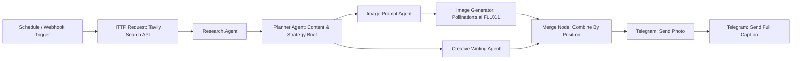
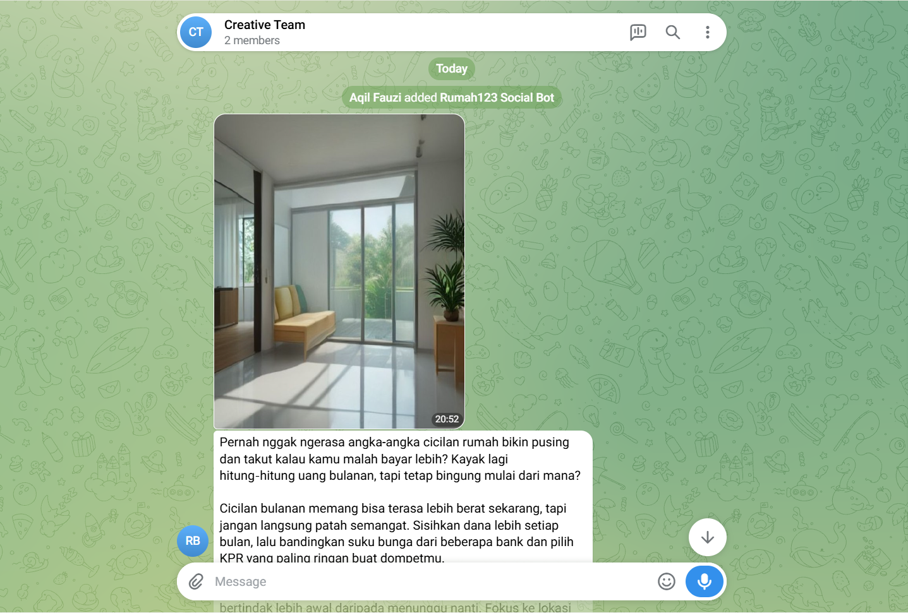
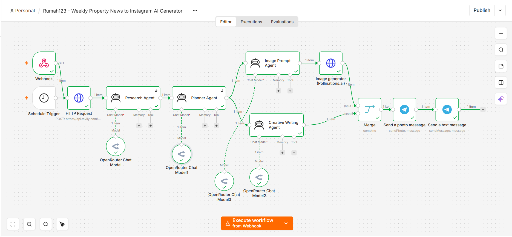

# Rumah123 - Automated Property News to Instagram Post Generator (Multi-Agent Pipeline)

An automated multi-agent workflow built on **n8n** that curates real-time Indonesian property news, formulates visual and copywriting marketing strategies, generates photorealistic architectural/interior imagery, and delivers ready-to-publish Instagram posts directly to Telegram.

## Pipeline Architecture



All four LLM agents (Research, Planner, Image Prompt, Creative Writing) run on OpenRouter's Free Models Router (`openrouter/free`). The reasoning behind this choice is explained in the [Design Decisions](#design-decisions--trade-offs) section below.

## Key Features

The workflow can run on a schedule (every Monday at 08:00) or be triggered on demand through a webhook. It pulls real-time property news through the Tavily AI Search API, focused on mortgage (KPR) policy and suburban housing trends from the last 7 days.

From there it's a chain of four agents. The Research Agent filters the raw news down to the single most relevant topic for first-time home buyers aged 26–33. The Planner Agent turns that into two briefs, one visual and one for copy, both aligned with Rumah123's brand identity. The Image Prompt Agent converts the visual brief into a detailed 35mm DSLR-style photography prompt, with negative constraints against text/watermark/logo overlays and distorted limbs. The Creative Writing Agent writes a conversational, humanlike Indonesian Instagram caption (140–170 words), explicitly steered away from stiff, press-release-sounding copy.

The image itself is generated at 1080×1350 (4:5 portrait) through Pollinations.ai (FLUX.1). Everything then lands in a Telegram review channel, photo first and caption second, so a person reviews it before it actually goes up on Instagram.

## Design Decisions & Trade-offs

The pipeline is split into specialized agents instead of one large prompt (Research → Planner → Image Prompt / Creative Writing) so each agent only has to focus on a single, narrow task. In practice, cramming research synthesis, strategy planning, image prompting, and copywriting into one prompt tends to degrade output quality once the context window gets long. Breaking it up keeps each stage more consistent.

Model selection went through a bit of trial and error. The first version pinned a specific free model (Gemma), but it kept hitting rate limits under repeated testing. Switching to `openrouter/free`, OpenRouter's Free Models Router, fixed that: requests now get distributed automatically across whatever free models are available at the time, instead of hammering one model's capacity. The downside is that output can vary slightly between runs since a different model might get picked each time. `maxRetries` is also set to `30` on every Chat Model node as an extra buffer against rate-limit failures.

Tavily is used for the news search because it's held up reliably for this kind of real-time retrieval task, and it's a pattern several other n8n builders use for similar research-agent setups.

For image generation, Pollinations.ai was picked mainly because this is currently a proof-of-concept build with no budget for paid image models. That said, the output doesn't have to stay a draft forever: it works fine for posting as-is, or as a reference image a graphic designer can refine if the project later moves to a paid model with better photorealism.

One implementation detail worth noting: the Merge node uses `combineByPosition`, so the Image Prompt Agent branch and Creative Writing Agent branch (which run in parallel off the Planner Agent) need to stay in sync by item order, otherwise the photo and caption could get mismatched.

## Future Improvements

If this moves past the proof-of-concept stage, the image model is probably the first thing I'd swap out. Pollinations.ai works fine for a draft, but a paid option like the Midjourney API or DALL-E 3 would get closer to publish-ready quality, especially for architectural proportions.

After that, auto-publishing would save the most manual work. Right now everything stops at Telegram for review, so someone still has to copy the caption and upload the photo by hand. Hooking up the Instagram Graph API, plus the equivalent for LinkedIn and Facebook Pages, would let approved posts go out on their own once someone gives the green light.

A couple of smaller things worth adding too: automatically stamping the Rumah123 logo and headline onto the photo before it reaches the review channel (something like Bannerbear could handle that), and an Approve/Regenerate button right inside Telegram via Webhook Callback, so approving a post doesn't mean switching apps. Longer term, it'd also be nice if the Creative Writing Agent could output more than just a single caption per run, things like carousel copy or a short Reels script from the same research input.

## Known Limitations

- Even with `openrouter/free` and `maxRetries: 30`, free-model capacity is shared across everyone using it, so runs can occasionally slow down or fail during high demand.
- The model gets auto-selected per run, so caption tone and image style can shift a bit from one execution to the next.
- Pollinations.ai (FLUX.1) output is treated as a draft or reference image, not something guaranteed to be publish-ready without a quick human check.
- The workflow stops at Telegram delivery on purpose. A human still reviews and manually publishes to Instagram instead of the pipeline posting directly.

## Tech Stack

- Workflow automation: n8n Cloud / Self-hosted
- News search: Tavily API
- LLM engine: OpenRouter Free Models Router (`openrouter/free`)
- Image generation: Pollinations.ai (FLUX.1)
- Delivery endpoint: Telegram Bot API

## Sample Output

Generated visual and caption, delivered to Telegram:


*Generated by the Image Prompt Agent → Pollinations.ai (FLUX.1), 1080×1350 portrait format.*



*Actual delivery result in the Telegram review channel. Photo sent first, followed by the full caption text.*



*The workflow as it looks in the n8n editor.*

## Repository Structure

```
├── Rumah123 - Weekly Property News to Instagram AI Generator.json   # Full exported n8n workflow definition
├── assets/
│   ├── sample_generated_post.jpg       # Sample output image generated by pipeline
│   ├── telegram_message.png            # Screenshot of the delivered Telegram message
│   └── workflow_canvas.png             # n8n canvas screenshot
└── README.md                           # Documentation
```

## Setup & Import to n8n

1. Import `Rumah123 - Weekly Property News to Instagram AI Generator.json` into your n8n workspace.
2. Configure your credentials:
   - Tavily API key: replace the `YOUR_TAVILY_API_KEY_HERE` placeholder in the HTTP Request node's body parameters.
   - OpenRouter API key: set up via n8n's credential store on the OpenRouter Chat Model nodes.
   - Telegram bot token: set up via n8n's credential store on the Telegram nodes.
   - Telegram chat ID: replace the `YOUR_TELEGRAM_CHAT_ID` placeholder in both Telegram nodes.
3. Activate the workflow for the weekly schedule, or trigger manually via the Webhook node.

*Muhammad Aqil Fauzi, AI Test submission for 99 Group.*
