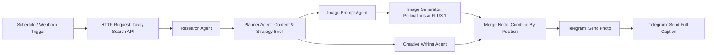

# Rumah123 - Automated Property News to Instagram Post Generator (Multi-Agent Pipeline)

An automated multi-agent workflow built on **n8n** that curates real-time Indonesian property news, formulates visual and copywriting marketing strategies, generates photorealistic architectural/interior imagery, and delivers ready-to-publish Instagram posts directly to Telegram.

---

## 🏛️ Pipeline Architecture



All four LLM agents (Research, Planner, Image Prompt, Creative Writing) run on OpenRouter's **Free Models Router** (`openrouter/free`). The reasoning behind this choice is explained in the [Design Decisions](#-design-decisions--trade-offs) section below.

---

## 🚀 Key Features

1. **Dual Trigger Support:** Scheduled weekly ingestion (cron, every Monday 08:00) or on-demand execution via Webhook.
2. **Real-Time Property Data:** Uses **Tavily AI Search API** to fetch mortgage (KPR), policy, and suburban housing trends from the last 7 days.
3. **Multi-Agent Orchestration:**
   - **Research Agent:** Filters raw news data and extracts the single most impactful topic for first-time home buyers aged 26–33.
   - **Planner Agent:** Turns research findings into a visual brief and a copywriting brief aligned with Rumah123 brand identity.
   - **Image Prompt Agent:** Converts the visual brief into a detailed 35mm DSLR-style photography prompt with strict negative constraints (no text/watermark/logo overlays, no distorted limbs).
   - **Creative Writing Agent:** Writes a conversational, humanlike Indonesian Instagram caption (140–170 words) with explicit negative constraints against stiff/formal press-release wording.
4. **Dynamic Visual Generation:** Generates 1080×1350 (4:5 portrait) photorealistic images using **Pollinations.ai (FLUX.1)**.
5. **Human-in-the-Loop Delivery:** Sequential photo and full-caption delivery to a Telegram review channel before manual posting to Instagram.

---

## 🎯 Design Decisions & Trade-offs

The pipeline is split into specialized agents instead of one large prompt (Research → Planner → Image Prompt / Creative Writing) so each agent only has to focus on a single, narrow task. In practice, cramming research synthesis, strategy planning, image prompting, and copywriting into one prompt tends to degrade output quality once the context window gets long. Breaking it up keeps each stage more consistent.

Model selection went through a bit of trial and error. The first version pinned a specific free model (Gemma), but it kept hitting rate limits under repeated testing. Switching to `openrouter/free`, OpenRouter's Free Models Router, fixed that: requests now get distributed automatically across whatever free models are available at the time, instead of hammering one model's capacity. The downside is that output can vary slightly between runs since a different model might get picked each time. `maxRetries` is also set to `30` on every Chat Model node as an extra buffer against rate-limit failures.

Tavily is used for the news search because it's held up reliably for this kind of real-time retrieval task, and it's a pattern several other n8n builders use for similar research-agent setups.

For image generation, Pollinations.ai was picked mainly because this is currently a proof-of-concept build with no budget for paid image models. The output doesn't have to be the final asset though — it works fine as-is for posting directly, or as a reference image a graphic designer can refine if the project later moves to a paid model with better photorealism.

One implementation detail worth noting: the Merge node uses `combineByPosition`, so the Image Prompt Agent branch and Creative Writing Agent branch (which run in parallel off the Planner Agent) need to stay in sync by item order, otherwise the photo and caption could get mismatched.

---

## ⚠️ Known Limitations

- **Free-tier rate limits:** even with `openrouter/free` and `maxRetries: 30`, free-model capacity is shared across everyone using it, so runs can occasionally slow down or fail during high demand.
- **Output consistency:** since the model is auto-selected per run, caption tone and image style can shift a bit from one execution to the next.
- **Image quality ceiling:** Pollinations.ai (FLUX.1) output is treated as a draft or reference image, not something guaranteed to be publish-ready without a quick human check.
- **No auto-posting:** the workflow stops at Telegram delivery on purpose. A human still reviews and manually publishes to Instagram instead of the pipeline posting directly.

---

## 🛠️ Tech Stack

- **Workflow Automation:** n8n Cloud / Self-hosted
- **News Search:** Tavily API
- **LLM Engine:** OpenRouter — Free Models Router (`openrouter/free`)
- **Image Generation:** Pollinations.ai (FLUX.1)
- **Delivery Endpoint:** Telegram Bot API

---

## 📁 Repository Structure

```
├── Rumah123 - Weekly Property News to Instagram AI Generator.json   # Full exported n8n workflow definition
├── assets/
│   ├── sample_generated_post.png       # Sample output image generated by pipeline
│   └── workflow_canvas.png             # n8n canvas screenshot
└── README.md                           # Documentation
```

---

## 🔧 Setup & Import to n8n

1. Import `Rumah123 - Weekly Property News to Instagram AI Generator.json` into your n8n workspace.
2. Configure your credentials:
   - **Tavily API Key** — replace the `YOUR_TAVILY_API_KEY_HERE` placeholder in the HTTP Request node's body parameters.
   - **OpenRouter API Key** — set up via n8n's credential store on the OpenRouter Chat Model nodes.
   - **Telegram Bot Token** — set up via n8n's credential store on the Telegram nodes.
   - **Telegram Chat ID** — replace the `YOUR_TELEGRAM_CHAT_ID` placeholder in both Telegram nodes.
3. Activate the workflow for the weekly schedule, or trigger manually via the Webhook node.

---

## 👤 Author

Aqil Fauzi, AI Test submission for 99 Group.
