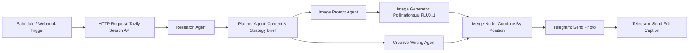

# Rumah123 - Automated Property News to Instagram Post Generator (Multi-Agent Pipeline)

An automated multi-agent workflow built on **n8n** that curates real-time Indonesian property news, formulates visual and copywriting marketing strategies, generates photorealistic architectural/interior imagery, and delivers ready-to-publish Instagram posts directly to Telegram.

---

## 🏛️ Pipeline Architecture



All four LLM agents (Research, Planner, Image Prompt, Creative Writing) run on OpenRouter's **Free Models Router** (`openrouter/free`) — see [Design Decisions](#-design-decisions--trade-offs) for why.

---

## 🚀 Key Features

1. **Dual Trigger Support:** Scheduled weekly ingestion (cron, every Monday 08:00) or on-demand execution via Webhook.
2. **Real-Time Property Data:** Uses **Tavily AI Search API** to fetch mortgage (KPR), policy, and suburban housing trends from the last 7 days.
3. **Multi-Agent Orchestration:**
   - **Research Agent:** Filters raw news data and extracts the single most impactful topic for first-time home buyers aged 26–33.
   - **Planner Agent:** Turns research findings into a visual brief and a copywriting brief aligned with Rumah123 brand identity.
   - **Image Prompt Agent:** Converts the visual brief into a detailed 35mm DSLR-style photography prompt with strict negative constraints (no text/watermark/logo overlays, no distorted limbs).
   - **Creative Writing Agent:** Writes a conversational, humanlike Indonesian Instagram caption (140–170 words) with explicit negative constraints against stiff/formal press-release wording.
4. **Dynamic Visual Generation:** Generates 1080×1350 (4:5 portrait) photorealistic images using **Pollinations.ai (FLUX.1)**.
5. **Human-in-the-Loop Delivery:** Sequential photo and full-caption delivery to a Telegram review channel before manual posting to Instagram.

---

## 🎯 Design Decisions & Trade-offs

**Why multi-agent instead of one large prompt?**
Splitting the pipeline into specialized agents (Research → Planner → Image Prompt / Creative Writing) keeps each agent focused on a single, narrow task. This produces more consistent output per stage and avoids the quality degradation that tends to happen when a single model is asked to hold a long context window and juggle multiple unrelated instructions (research synthesis, strategy planning, image prompting, and copywriting all at once).

**Why `openrouter/free` instead of a specific model like Gemma?**
Early iterations pinned a specific free model, which hit rate limits quickly under repeated testing. Switching to `openrouter/free` — OpenRouter's official **Free Models Router** — lets the platform automatically distribute requests across whichever free models are currently available, rather than depending on the capacity of one model/provider. The trade-off is that output consistency can vary slightly between runs, depending on which model gets selected. As an additional safety layer, `maxRetries` is set to `30` on every Chat Model node to absorb transient rate-limit failures.

**Why Tavily for news search?**
Tavily was chosen for its reliability on this type of real-time news retrieval task, and it's a pattern also used by other n8n creators building similar research-agent workflows.

**Why Pollinations.ai instead of a paid image model?**
This project is intentionally scoped as a proof-of-concept pipeline, built under a no-budget constraint for paid image generation. The generated image is designed to be flexible: it can either be used directly as the final Instagram post image, or serve as a visual reference for a graphic designer to refine, if the pipeline is later upgraded to a paid model with stronger photorealism.

**Merge strategy note:** The Merge node uses `combineByPosition`, meaning the Image Prompt Agent branch and Creative Writing Agent branch (which run in parallel from the Planner Agent) must stay in sync by item order for the photo and caption to pair up correctly.

---

## ⚠️ Known Limitations

- **Free-tier rate limits:** Even with `openrouter/free` and `maxRetries: 30`, free-model capacity is shared and can occasionally cause slower runs or failed executions during high demand.
- **Output consistency:** Because the underlying model is auto-selected per run, caption tone and image style can vary slightly between executions.
- **Image quality ceiling:** Pollinations.ai (FLUX.1) output is treated as a draft/reference image, not guaranteed to be publish-ready without a human review step.
- **Manual final review required:** The workflow stops at Telegram delivery by design — a human reviews and manually publishes to Instagram, rather than the pipeline auto-posting.

---

## 🛠️ Tech Stack

- **Workflow Automation:** n8n Cloud / Self-hosted
- **News Search:** Tavily API
- **LLM Engine:** OpenRouter — Free Models Router (`openrouter/free`)
- **Image Generation:** Pollinations.ai (FLUX.1)
- **Delivery Endpoint:** Telegram Bot API

---

## 📁 Repository Structure

```
├── Rumah123 - Weekly Property News to Instagram AI Generator.json   # Full exported n8n workflow definition
├── assets/
│   ├── sample_generated_post.png       # Sample output image generated by pipeline
│   └── workflow_canvas.png             # n8n canvas screenshot
└── README.md                           # Documentation
```

---

## 🔧 Setup & Import to n8n

1. Import `Rumah123 - Weekly Property News to Instagram AI Generator.json` into your n8n workspace.
2. Configure your credentials:
   - **Tavily API Key** — replace the `YOUR_TAVILY_API_KEY_HERE` placeholder in the HTTP Request node's body parameters.
   - **OpenRouter API Key** — set up via n8n's credential store on the OpenRouter Chat Model nodes.
   - **Telegram Bot Token** — set up via n8n's credential store on the Telegram nodes.
   - **Telegram Chat ID** — replace the `YOUR_TELEGRAM_CHAT_ID` placeholder in both Telegram nodes.
3. Activate the workflow for the weekly schedule, or trigger manually via the Webhook node.

---

## 👤 Author

Aqil Fauzi — AI Test submission for 99 Group.
